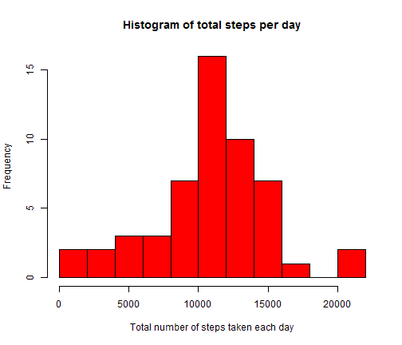
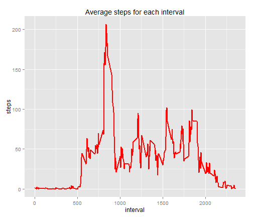
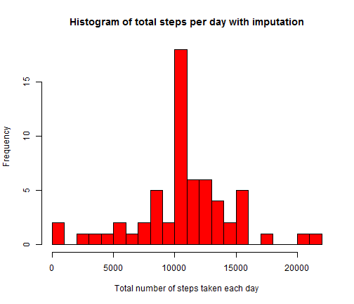
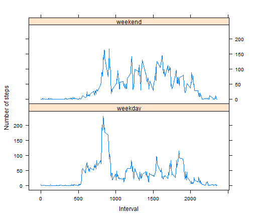

## Loading and preprocessing the data

Loading Necessary Graphics Package


```r
library (ggplot2)
library (lattice)
```

#### 1. Load the data (i.e. read.csv()) 

```r
#### The data is downloaded from source provided in Coursera Project 1 that link to
#### https://d396qusza40orc.cloudfront.net/repdata%2Fdata%2Factivity.zip

activity <- read.csv("./data/activity.csv",  sep = ",", header = TRUE, stringsAsFactors = FALSE)
head(activity)
```

```
##   steps       date interval
## 1    NA 2012-10-01        0
## 2    NA 2012-10-01        5
## 3    NA 2012-10-01       10
## 4    NA 2012-10-01       15
## 5    NA 2012-10-01       20
## 6    NA 2012-10-01       25
```

```r
tail(activity)
```

```
##       steps       date interval
## 17563    NA 2012-11-30     2330
## 17564    NA 2012-11-30     2335
## 17565    NA 2012-11-30     2340
## 17566    NA 2012-11-30     2345
## 17567    NA 2012-11-30     2350
## 17568    NA 2012-11-30     2355
```

#### 2. Process/transform the data suitable for analysis
Looking into head and tail of activity, it is not necessary to transform the data. Wherever required "na.rm=T" can be used.

## What is mean total number of steps taken per day?

#### 1. Calculate the total number of steps taken per day

```r
#### aggregate function is used to calculate sum of steps according to date.
step_activity<-aggregate(steps~date,activity,sum,na.rm=T)
```

#### 2. Creating a histogram of the total number of steps taken each day

```r
hist(step_activity$steps,breaks=12, col="orange", xlab = "Total number of steps taken each day", main = "Histogram of total steps per day")
```

 

#### 3. Calculate and report the mean and median of the total number of steps taken per day

```r
mean(step_activity$steps)
```

```
## [1] 10766.19
```

```r
median(step_activity$steps)
```

```
## [1] 10765
```

```r
summary(step_activity$steps)
```

```
##    Min. 1st Qu.  Median    Mean 3rd Qu.    Max. 
##      41    8841   10760   10770   13290   21190
```

##  What is the average daily activity pattern?

#### 1. Time series plot of the 5-minute interval (x-axis) and the average number of steps taken, averaged across all days (y-axis)

```r
#### aggregate function is used to calculate mean of steps according to interval. Our interval is of 5 steps
step_interval_activity<- aggregate(steps ~ interval, activity, mean,na.rm=T)

g <- ggplot(step_interval_activity, aes(interval, steps))
g + geom_line(size=1,col="orange")+labs(title="Average steps for each interval")
```

 

#### 2. Which 5-minute interval, on average across all the days in the dataset, contains the maximum number of steps?

```r
step_interval_activity[step_interval_activity$steps == max(step_interval_activity$steps), ]
```

```
##     interval    steps
## 104      835 206.1698
```

## Imputing missing values  

#### 1. The total number of missing values in the dataset (i.e. the total number of rows with NAs)

```r
numMissingValues <- length(which(is.na(activity$steps)))
numMissingValues 
```

```
## [1] 2304
```
The total number of rows with NAs is 2304.

#### 2. Devise a strategy for filling in all of the missing values in the dataset. 

#### 3. Create a new dataset that is equal to the original dataset but with the missing data filled in.

The dataset is created to fill all missing values as follows


```r
### I am using R version 3.2.2.So Impute package can not be used.
### So I assign the missing values as follows

new_activity<-activity  # new dataset without NAs
interval<-tapply(activity$steps, activity$interval, mean, na.rm=T)
for (i in 1:nrow(activity)){
  if(is.na(activity$steps[i])){
     new_activity$steps[i]<- interval[[as.character(activity[i, "interval"])]]
  }
}
#### Checking the number of missing value in new dataset
numMissingValues <- length(which(is.na(new_activity$steps)))
numMissingValues
```

```
## [1] 0
```
After imputing, the count of NAs values is 0.

#### 4. Make a histogram of the total number of steps taken each day 

```r
step_activity_imputed<-tapply(new_activity$steps, new_activity$date, sum)
hist(step_activity_imputed,breaks=16,col = "orange" ,xlab = "Total number of steps taken each day", main = "Histogram of total steps per day with imputation")
```

 

#### 5. Calculate and report the mean and median total number of steps taken per day

```r
mean(step_activity_imputed)
```

```
## [1] 10766.19
```

```r
median(step_activity_imputed)
```

```
## [1] 10766.19
```

```r
summary(step_activity_imputed)
```

```
##    Min. 1st Qu.  Median    Mean 3rd Qu.    Max. 
##      41    9819   10770   10770   12810   21190
```
There isnont significant change after populating N/A values. The median becomes little higher than before but summary seems to be same.

## Are there differences in activity patterns between weekdays and weekends?

#### 1. Create a new factor variable in the dataset with two levels - "weekday" and "weekend" 

```r
new_activity$dateType <-  ifelse(as.POSIXlt(new_activity$date)$wday %in% c(0,6), 'weekend', 'weekday')
table(new_activity$dateType)
```

```
## 
## weekday weekend 
##   12960    4608
```

#### 2. Panel plot for a time series plot of the 5-minute interval (x-axis) and the average number of steps  taken, averaged across all weekday days or weekend days (y-axis)

```r
average_step_interval_new_activity <- aggregate(steps ~ interval + dateType, data=new_activity, mean)
average_step_interval_new_activity <- aggregate(new_activity$steps, list(interval = as.numeric(as.character(new_activity$interval)), weekdays=new_activity$dateType),FUN = "mean")
names(average_step_interval_new_activity)[3] <- "meanOfSteps"
xyplot(average_step_interval_new_activity$meanOfSteps ~ average_step_interval_new_activity$interval | average_step_interval_new_activity$weekdays, 
       layout = c(1, 2), type = "l", 
       xlab = "Interval", ylab = "Number of steps")
```

 
